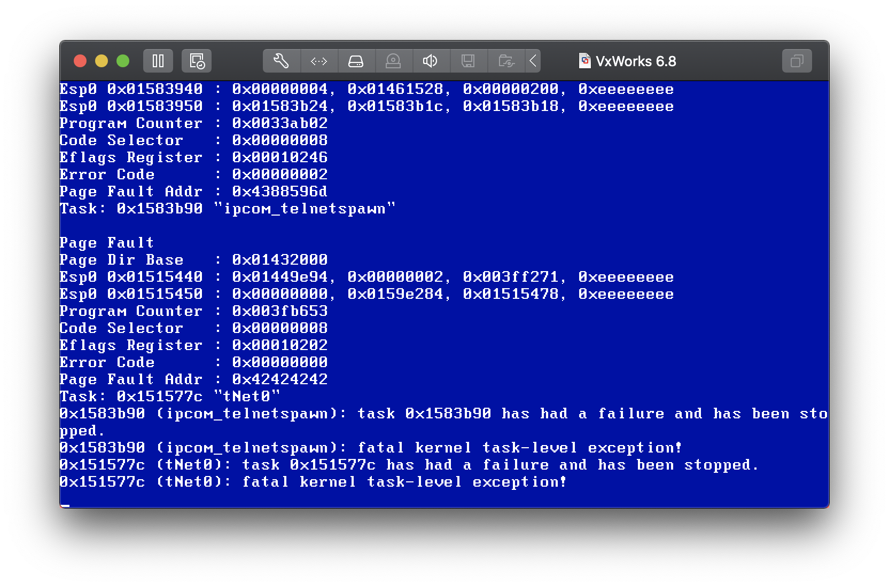

# CVE-2019-12255

This PoC was developed by [dazhouzhou](https://github.com/dazhouzhou/vxworks-poc/tree/master/CVE-2019-12255).

## Run

```shell
$ sudo iptables -A OUTPUT -p tcp --tcp-flags RST RST -s 172.18.101.121 -j DROP
$ sudo python3 poc.py
```

The OS will send RST (reset) packets when receiving unsolicited packets. We can use iptables to avoid this.

## Screenshot

