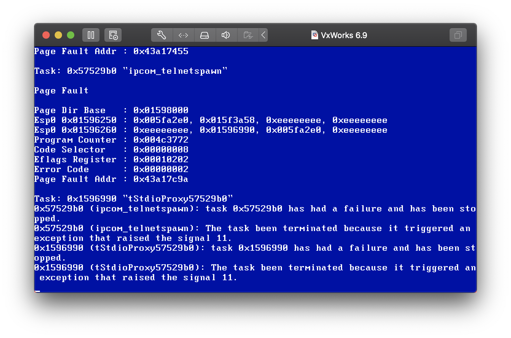

# CVE-2019-12260

This PoC sends packet with the TCP Authentication Option (TCP-AO). Use this [fork](https://github.com/iweizime/scapy/tree/tcp-ao) of Scapy because the official [Scapy](https://github.com/iweizime/scapy) does not support TCP-AO.

## Run

```shell
$ sudo iptables -A OUTPUT -p tcp --tcp-flags RST RST -s 172.18.101.121 -j DROP
$ sudo python3 poc.py
```

The OS will send RST (reset) packets when receiving unsolicited packets. We can use iptables to avoid this.

## Screenshot

